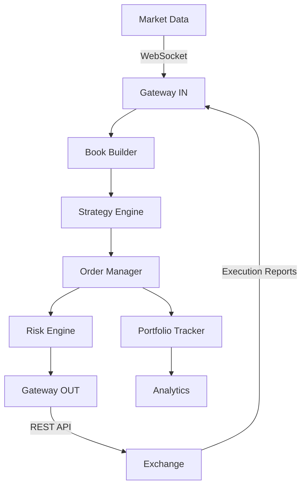

# Trading System Development Project

## Project Overview

Build a production-grade event-driven trading system with proper separation between backtesting simulation and live execution. The architecture should demonstrate understanding of concurrent system design, low-latency optimization, and financial market microstructure.

**Core Philosophy:** Every component is designed for multi-threaded production deployment, even if initial implementation is single-threaded. Message-passing architecture with clear interfaces enables independent scaling and testing.

---

## Architecture Overview

### System Components

```
┌─────────────────────────────────────────────────────────────────┐
│                        Trading System                           │
├─────────────────────────────────────────────────────────────────┤
│                                                                 │
│  ┌──────────────┐    ┌──────────────┐    ┌──────────────┐       │
│  │   Gateway    │───▶│     Book     │───▶│   Strategy   │       │
│  │   IN (Data)  │    │   Builder    │    │    Engine    │       │
│  └──────────────┘    └──────────────┘    └──────────────┘       │
│         │                                        │              │
│         │                                        ▼              │
│         │                                 ┌──────────────┐      │
│         │                                 │    Order     │      │
│         │                                 │   Manager    │      │
│         │                                 └──────────────┘      │
│         │                                        │              │
│         │                                        ▼              │
│         │                                 ┌──────────────┐      │
│         │                                 │     Risk     │      │
│         │                                 │    Engine    │      │
│         │                                 └──────────────┘      │
│         │                                        │              │
│         ▼                                        ▼              │
│  ┌──────────────┐                        ┌──────────────┐       │
│  │   Gateway    │◀───────────────────────│  Execution   │       │
│  │  OUT (Orders)│                        │   Emulator   │       │
│  └──────────────┘                        └──────────────┘       │
│         │                                        │              │
│         │                                        │              │
│         └────────────────┬───────────────────────┘              │
│                          ▼                                      │
│                   ┌──────────────┐                              │
│                   │   Portfolio  │                              │
│                   │   Tracker    │                              │
│                   └──────────────┘                              │
│                          │                                      │
│                          ▼                                      │
│                   ┌──────────────┐                              │
│                   │   Analytics  │                              │
│                   │   & Logger   │                              │
│                   └──────────────┘                              │
└─────────────────────────────────────────────────────────────────┘
```

**Key architectural principles:**
- **Low Latency:** Minimize hops, avoid blocking, optimize memory access
- **Concurrency:** Each component can run in dedicated thread/process
- **Modularity:** Swap components (e.g., simulated vs live gateway) without changing others
- **Resilience:** Fail-safe mechanisms, kill switches, watchdogs
- **Observability:** Structured logging, metrics, replay capability

**Learning resources:**
- [Trading System Architecture Patterns](https://www.quantstart.com/articles/Event-Driven-Backtesting-with-Python-Part-I/)
- [Lock-Free Programming](https://preshing.com/20120612/an-introduction-to-lock-free-programming/)
- [Python Threading vs Multiprocessing](https://realpython.com/python-concurrency/)

---

## Part 1: Foundation - Message Protocols & Data Structures

### 1.1 Protocol Handlers (Gateway IN/OUT)

**Problem:** Trading systems communicate with exchanges using various protocols (FIX, WebSocket, REST). Need unified internal representation.

The Gateway layer acts as the boundary between external protocols and your internal system. Think of it as a translator: 
exchanges speak FIX/WebSocket, your core system speaks a clean internal language. The gateway converts between them.

#### Requirements:

**FIX Protocol Parser:**
- Implement FIX 4.2 message parsing
- Support message types:
  - Quote messages (streaming market data)
  - Order messages (NewOrderSingle, ExecutionReport, OrderCancelRequest)
- Session management: Logon, Logon Acknowledgement, Heartbeat, Logout
- Message validation: Required tags, checksum verification, sequence numbers

**WebSocket Handler:**
- Async I/O for real-time data streams
- Protocol: Subscription, streaming updates (full snapshot vs incremental)
- Connection management: Logon/authentication, heartbeat, reconnection logic
- Message framing and buffering

**Internal Message Format:**
- Define canonical data structures for: MarketDataEvent, OrderEvent, ExecutionReport
- Bidirectional conversion: FIX ↔ Internal ↔ JSON
- Serialization for logging and replay

**Design considerations:**
- Gateway IN: Parse incoming market data (quotes/prices)
- Gateway OUT: Format and send outgoing orders
- Both gateways must handle protocol-specific details without exposing them to core system

**Learning resources:**
- [FIX Protocol Documentation](https://www.fixtrading.org/standards/)
- [FIX Message Parser Tool](https://fixparser.targetcompid.com/)
- [FIX Field Reference](https://ref.onixs.biz/fix-message.html)
- [WebSocket Protocol RFC 6455](https://datatracker.ietf.org/doc/html/rfc6455)
- [Python asyncio tutorial](https://realpython.com/async-io-python/)

---

### 1.2 Book Builder (Order Book Management)

**Problem:** Maintain real-time order book from streaming market data. Support efficient best bid/ask queries and order matching logic.

#### Requirements:

**Order Book Data Structure:**
- Price-level aggregation: Each price level contains queue of orders
- Use efficient structures:
  - Heap-based: `heapq` for bid/ask sides (max-heap for bids, min-heap for asks)
  - Tree-based: `sortedcontainers.SortedDict` for O(log n) operations
  - Hybrid: Price levels in tree, orders within level in deque (FIFO)

**Operations:**
- `add_order(order)` - Insert with price-time priority
- `modify_order(order_id, new_qty)` - Update existing order
- `cancel_order(order_id)` - Remove from book
- `get_top_of_book()` - Return best bid/ask in O(1)
- `match_against_book(order)` - Execute matching logic for incoming order
- `get_market_depth(levels)` - Return L2 data (aggregated quantities at each price)

**Market Microstructure Modeling:**
- Order book snapshots (full state at timestamp)
- Incremental updates (add/modify/cancel events)
- Derived metrics: Bid-ask spread, order imbalance, depth-weighted mid-price
- Queue position tracking for limit orders

**Performance Requirements:**
- Support 10,000+ orders per symbol
- Best bid/ask lookup: O(1) constant time
- Order insertion/cancellation: O(log n) logarithmic time
- Book snapshot: O(n) linear in number of price levels

**Learning resources:**
- [Order Book Implementation Guide](https://web.archive.org/web/20110219163448/http://howtohft.wordpress.com/2011/02/15/how-to-build-a-fast-limit-order-book/)
- [Market Microstructure Theory](https://www.investopedia.com/terms/m/microstructure.asp)
- [Priority Queue (Heap) Tutorial](https://realpython.com/python-heapq-module/)
- [SortedContainers Library](http://www.grantjenks.com/docs/sortedcontainers/)
- [NBBO (National Best Bid Offer) Explained](https://www.investopedia.com/terms/n/nbbo.asp)

---

### 1.3 Order Manager (Lifecycle Management)

**Problem:** Track orders through their complete lifecycle. Ensure state transitions are valid, audit all changes, and maintain thread-safe state.

#### Requirements:

**Order State Machine:**
- States: NEW, PENDING_NEW, ACKNOWLEDGED, PARTIAL_FILL, FILLED, PENDING_CANCEL, CANCELED, REJECTED
- Transitions:
  ```
  NEW → PENDING_NEW (sent to gateway)
  PENDING_NEW → ACKNOWLEDGED (exchange confirms)
  PENDING_NEW → REJECTED (exchange rejects)
  ACKNOWLEDGED → PARTIAL_FILL (partial execution)
  ACKNOWLEDGED/PARTIAL_FILL → FILLED (complete execution)
  ACKNOWLEDGED/PARTIAL_FILL → PENDING_CANCEL (cancel requested)
  PENDING_CANCEL → CANCELED (cancel confirmed)
  ```
- Invalid transitions raise exceptions and log errors

**Order Tracking:**
- Maintain in-memory order book: `Dict[order_id, Order]`
- Two-level ID system: Client order ID (internal) + Exchange order ID (venue)
- Support order modifications: Cancel-replace logic
- Handle unsolicited cancels (exchange-initiated)

**Audit Trail:**
- Log every state transition with timestamp
- Record: Who initiated (strategy/trader/system), reason (risk check/signal/manual), venue response
- Support compliance queries: "Show all rejected orders for symbol X"

**Thread Safety:**
- Order state updates must be atomic
- Consider: Lock-based (threading.Lock) vs lock-free (queue-based updates)
- Design for: Multiple strategies submitting orders concurrently

**Routing Logic:**
- Determine which venue/gateway to send order
- Handle multi-venue scenarios: Route to venue with best quote
- Smart order routing (SOR): Split large orders across venues

**Learning resources:**
- [State Machine Pattern](https://refactoring.guru/design-patterns/state)
- [Python Enums for State Management](https://docs.python.org/3/library/enum.html)
- [Thread-Safe Collections](https://docs.python.org/3/library/queue.html)
- [Order Lifecycle Documentation](https://www.interactivebrokers.com/en/trading/orders/order-lifecycle.php)

---

### 1.4 Risk Engine (Pre-Trade Validation)

**Problem:** Block orders that violate risk limits before they reach the exchange. Must be fast (<100μs) and composable.

#### Requirements:

**Risk Check Types:**

1. **Max Order Size**
   - Purpose: Prevent fat-finger errors
   - Logic: `order.quantity <= max_order_size[symbol]`
   - Action: Reject if exceeded

2. **Max Position**
   - Purpose: Limit exposure per symbol
   - Logic: `abs(current_position[symbol] + order.signed_quantity) <= max_position[symbol]`
   - Tracks: Net position (long - short)

3. **Price Band**
   - Purpose: Reject orders far from market
   - Logic: `abs(order.price - market_mid) / market_mid <= price_tolerance`
   - Example: Reject if order price is >5% away from mid

4. **Self-Trade Prevention**
   - Purpose: Avoid washing trades (buying and selling with yourself)
   - Logic: Check if order would match against own resting orders
   - Action: Cancel or reject

5. **Throttling**
   - Purpose: Limit order rate (prevent spam)
   - Logic: Track orders per second per symbol
   - Example: Max 10 orders/second per symbol

6. **Kill Switch**
   - Purpose: Emergency shutdown on anomaly
   - Triggers: Loss exceeds threshold, position limit breach, system error
   - Action: Cancel all open orders, reject new orders

**Architecture:**
- Each risk check is a separate `RiskValidator` class
- `RiskEngine` composes multiple validators
- Validators run in sequence (fail-fast on first violation)
- Configuration-driven: Load limits from YAML/JSON

**Performance:**
- Total risk check latency: <100μs
- Use efficient lookups: Dictionaries for position/limit checks
- Avoid expensive computations: Pre-calculate position deltas

**Observability:**
- Log every risk check: Passed/failed, which validator, reason
- Metrics: Risk check latency percentiles, rejection rate by type
- Alerts: When approaching limits (e.g., 90% of max position)

**Learning resources:**
- [Trading Risk Management](https://www.cmegroup.com/education/courses/introduction-to-risk-management.html)
- [Strategy Pattern for Composable Validators](https://refactoring.guru/design-patterns/strategy)
- [Configuration Management in Python](https://realpython.com/python-yaml/)
- [Performance Profiling in Python](https://docs.python.org/3/library/profile.html)

---

### 1.5 Structured Logging & Event Architecture

**Problem:** Capture all system events for compliance, debugging, latency analysis, and post-trade forensics. Logs must be queryable and replayable.

#### Requirements:

**Log Architecture Dimensions:**

1. **Granularity**
   - Per-message: Each market data tick, each order state change
   - Per-order: Aggregate lifecycle (submitted → filled)
   - Per-session: Trading session summary
   - Per-component: Strategy signals, risk decisions

2. **Latency Consideration**
   - Logging must not block execution (<1ms overhead)
   - Async logging: Write to buffer, flush to disk in separate thread
   - Consider: Memory-mapped files, lock-free queues

3. **Durability**
   - Logs must survive crashes
   - Write-ahead logging (WAL): Record intent before action
   - Periodic checkpoints: Snapshot system state

4. **Format**
   - Structured: JSON Lines (one JSON object per line)
   - Alternative: Binary formats (Protocol Buffers, Avro) for high-frequency
   - Fields: timestamp (nanoseconds), event_type, component, order_id, symbol, data

5. **Storage**
   - Local disk: Fast writes, limited retention
   - Distributed file system: HDFS, AWS S3 for archival
   - Time-series database: InfluxDB, TimescaleDB for metrics
   - Regulatory: 5-7 year retention required for compliance

6. **Retention Policy**
   - Hot storage (1 month): SSD, queryable in real-time
   - Warm storage (1 year): HDD, slower queries
   - Cold storage (5+ years): Cloud archive (S3 Glacier)

**Event Types:**
```python
{
  "timestamp": "2025-01-15T14:32:11.123456789Z",
  "event_type": "OrderCreated",
  "component": "OrderManager",
  "order_id": "ORD-12345",
  "symbol": "AAPL",
  "side": "BUY",
  "quantity": 100,
  "price": 150.25,
  "order_type": "LIMIT"
}
```

**Replay Capability:**
- Read log sequentially and reconstruct system state
- Verify: Position calculations, P&L, risk breaches
- Use case: Debug why order was rejected, analyze fill quality

**Metrics Collection:**
- Separate from event logging
- Track: Latency percentiles (p50, p95, p99), throughput (orders/sec), error rates
- Export format: Prometheus (for Grafana dashboards)

**Learning resources:**
- [Structured Logging Best Practices](https://www.honeycomb.io/blog/structured-logging-and-your-team)
- [JSON Lines Format](https://jsonlines.org/)
- [Write-Ahead Logging Explained](https://en.wikipedia.org/wiki/Write-ahead_logging)
- [Python Logging Module](https://docs.python.org/3/library/logging.html)
- [InfluxDB for Time-Series](https://www.influxdata.com/)
- [Prometheus Metrics](https://prometheus.io/docs/introduction/overview/)

---

## Part 2: Strategy & Execution Layer

### 2.1 Strategy Engine (Signal Generation & Decision Making)

**Problem:** Generate trading signals from market data while maintaining internal state (positions, indicators, cooldowns). Must be pluggable (swap strategies without changing infrastructure).

#### Requirements:

**Core Functions:**

1. **Signal Processing**
   - Detect patterns, triggers, statistical edges
   - Examples:
     - Price-based: SMA crossover, breakout above resistance
     - Volume-based: Unusual volume spike (>3x average)
     - Order book: Bid-ask spread widening, depth imbalance
     - Statistical: Z-score exceeds ±2, cointegration residual
     - Machine learning: Model output probability > 0.8

2. **Order Generation**
   - Translate signals into actionable orders
   - Specify: Symbol, side (BUY/SELL), quantity, order type (MARKET/LIMIT), price
   - Position sizing logic: Fixed, risk-based (Kelly criterion), volatility-adjusted

3. **Position Tracking**
   - Maintain current holdings per symbol
   - Calculate: Net position, average entry price, unrealized P&L
   - Risk awareness: Don't exceed exposure limits

4. **Risk Awareness**
   - Adapt to market conditions: Reduce size in high volatility
   - Respect limits: Don't generate orders that will be rejected
   - Dynamic adjustments: Scale down if approaching drawdown threshold

5. **State Management**
   - Internal variables: Cooldowns (don't retrade immediately), flags (is position open?)
   - Indicator state: Rolling windows for moving averages, exponential smoothing parameters
   - Persistence: Save state to disk for recovery after restart

**Strategy Interface (Abstract Base Class):**
```python
class Strategy(ABC):
    @abstractmethod
    def on_market_data(self, event: MarketDataEvent) -> List[Signal]:
        """Process incoming market data, return signals"""
        pass
    
    @abstractmethod
    def on_order_update(self, event: OrderEvent) -> None:
        """Handle order acknowledgements, fills, cancellations"""
        pass
    
    @abstractmethod
    def on_fill(self, event: FillEvent) -> None:
        """Update internal position tracking after execution"""
        pass
```

**Example Strategy Implementations:**

1. **Momentum Strategy**
   - Signal: Price crosses above 50-day SMA → BUY, crosses below → SELL
   - Parameters: SMA period, position size
   - State: Last SMA value, current position

2. **Mean Reversion Strategy**
   - Signal: RSI < 30 → BUY (oversold), RSI > 70 → SELL (overbought)
   - Parameters: RSI period, thresholds
   - State: Price history for RSI calculation

3. **Statistical Arbitrage (Pairs Trading)**
   - Signal: Spread between two assets exceeds 2 standard deviations
   - Logic: Buy underperformer, sell outperformer
   - State: Spread history, cointegration parameters

4. **Machine Learning Strategy**
   - Signal: Model predicts positive return with >0.8 probability
   - Features: Technical indicators, market microstructure, sentiment
   - State: Model parameters, feature history

**Pluggable Design:**
- Strategies loaded from config: `strategy_type: "momentum"`, `parameters: {sma_period: 50}`
- Swap strategies without recompiling: Config change + restart
- Multiple strategies can run concurrently: Different logic per symbol or timeframe

**Learning resources:**
- [Algorithmic Trading Strategies](https://www.quantstart.com/articles/Algorithmic-Trading-Strategies/)
- [Technical Indicators Library (TA-Lib)](https://ta-lib.org/)
- [Abstract Base Classes in Python](https://docs.python.org/3/library/abc.html)
- [Mean Reversion Strategies](https://www.quantstart.com/articles/Mean-Reversion-Trading-Strategy/)
- [Pairs Trading Explained](https://www.investopedia.com/terms/p/pairstrade.asp)

---

### 2.2 Execution Emulator (Backtesting Matching Engine)

**Problem:** Simulate realistic order execution for backtesting. Model latency, slippage, partial fills, and market constraints.

#### Requirements:

**Fill Models:**

1. **Market Orders**
   - Immediate fill at best available price
   - Walk the book: Fill against resting limit orders
   - Price impact: Large orders move price (consume multiple levels)
   - Slippage: Execution price worse than quoted mid
     - Model: `fill_price = mid + slippage_bps * mid * sign(order)`
     - Example: 5 bps slippage on buy → pay 0.05% more

2. **Limit Orders**
   - Fill when market price touches order price
   - Queue position: If order is 10th in queue at price level, fill after 9 ahead
   - Partial fills: Fill available quantity if not enough liquidity
   - Time-in-force: DAY (cancel at end of day), GTC (good till cancel), IOC (immediate or cancel)

3. **Stop Orders**
   - Trigger: When market price crosses stop price
   - Becomes market order after trigger
   - Slippage: Usually worse than stop price (market order execution)

**Latency Simulation:**
- **Order acknowledgement delay:** Time from submission to exchange confirmation
  - Typical: 1-10 milliseconds
  - Model: Fixed delay + random jitter
  - Example: 5ms + Uniform(0, 2ms)

- **Fill delay:** Time from order matching to execution report
  - Typical: 1-5 milliseconds
  - Model: Separate from ack delay

- **Network latency:** Round-trip time to exchange
  - Co-located: <1ms
  - Remote: 10-100ms

**Market Constraints:**

1. **Liquidity Limits**
   - Book depth: Can't fill more than available at price level
   - Example: If only 500 shares at $100, fill 500 and leave 500 unfilled

2. **Bid-Ask Spread**
   - Market orders cross the spread (pay ask for buy, receive bid for sell)
   - Cost: `spread_cost = (ask - bid) / 2`

3. **Price Bands (Circuit Breakers)**
   - Reject orders outside allowed price range
   - Example: ±5% from last trade price

4. **Trading Hours**
   - Reject orders outside market hours
   - Pre-market (4am-9:30am ET), regular (9:30am-4pm), after-hours (4pm-8pm)

**Partial Fill Scenarios:**
- Order for 1000 shares, only 600 available → Fill 600, leave 400 working
- Model: `fill_qty = min(order.quantity, available_liquidity)`
- Status: PARTIAL_FILL → emit ExecutionReport with filled qty

**Execution Report Generation:**
- Mimic exchange messages
- Fields: Order ID, symbol, fill price, fill quantity, remaining quantity, commission
- Timing: Send after simulated latency delay

**Advanced Modeling (Optional):**
- **Adverse selection:** Market orders tend to execute at worse prices during volatile periods
- **Queue jumping:** Some orders skip queue (hidden orders, internalization)
- **Market impact:** Large orders move market permanently (Kyle's Lambda model)

**Learning resources:**
- [Market Microstructure and Order Execution](https://www.cfainstitute.org/-/media/documents/book/rf-publication/2015/rf-v2015-n1-1.ashx)
- [Slippage Models](https://robotwealth.com/estimating-slippage-for-backtesting/)
- [Order Types Explained](https://www.investopedia.com/terms/o/order.asp)
- [Kyle's Lambda (Market Impact)](https://en.wikipedia.org/wiki/Kyle_model)
- [Latency in Trading Systems](https://www.quantstart.com/articles/High-Frequency-Trading-II-Limit-Order-Book/)

---

### 2.3 Portfolio Tracker & P&L Calculation

**Problem:** Track positions and calculate real-time P&L. Must handle both realized (closed trades) and unrealized (open positions) P&L.

#### Requirements:

**Position Tracking:**
- Maintain for each symbol:
  - Net quantity (long - short)
  - Average entry price (volume-weighted)
  - Unrealized P&L: `(current_price - avg_entry_price) * quantity`
  - Realized P&L: Sum of closed trade profits
  
**Position Updates:**
- On fill: Adjust quantity and recalculate average price
  - Opening trade: Increase position
  - Closing trade: Reduce position, realize P&L
  - Flip: Close position and open opposite (sell while long)

**P&L Attribution:**
- By symbol: Which instruments contributed most to P&L?
- By strategy: If multiple strategies, separate P&L per strategy
- By time: Intraday P&L curve (cumulative throughout day)

**Mark-to-Market:**
- Update unrealized P&L on every market data tick
- Use mid-price or last trade price for valuation
- Frequency: Real-time (every tick) vs periodic (every minute)

**Commission & Fees:**
- Model transaction costs:
  - Per-share: $0.005/share typical for equities
  - Percentage: 0.1% of notional for some markets
  - Flat fee: $1 per trade
- Include in realized P&L calculation

**Margin & Leverage:**
- Track margin usage: `margin_used = sum(abs(position_value))`
- Buying power: `cash - margin_used`
- Leverage ratio: `total_position_value / equity`

**Risk Metrics:**
- Real-time tracking:
  - Current drawdown: Distance from equity peak
  - Position concentration: Largest position as % of portfolio
  - Volatility: Rolling standard deviation of returns

**Learning resources:**
- [P&L Calculation Explained](https://www.investopedia.com/terms/p/plstatement.asp)
- [Mark-to-Market Accounting](https://www.investopedia.com/terms/m/marktomarket.asp)
- [Portfolio Risk Metrics](https://www.quantstart.com/articles/Portfolio-Risk-and-Return-Metrics/)

---

## Part 3: Backtesting Infrastructure

### 3.1 Historical Data Management

**Problem:** Store and efficiently query large volumes of historical market data for backtesting.

#### Requirements:

**Data Types:**

1. **Market Data (OHLCV)**
   - Fields: Timestamp, Symbol, Open, High, Low, Close, Volume
   - Granularity: 1-minute bars (primary), 5-min, 1-hour, daily
   - Storage: Parquet files (columnar, compressed)

2. **Tick Data (L1)**
   - Fields: Timestamp, Symbol, Bid, Ask, Bid Size, Ask Size, Last Trade Price
   - Use case: High-frequency backtesting
   - Volume: Much larger than bar data
   - Storage: Time-series database (InfluxDB, TimescaleDB) or Parquet

3. **Order Book Data (L2/L3)**
   - L2: Aggregated price levels with quantities
   - L3: Full order-level data with order IDs
   - Use case: Microstructure-aware backtesting, queue position modeling
   - Storage: Binary formats (HDF5, Protocol Buffers) for efficiency

4. **Fundamental Data**
   - Fields: Earnings, revenue, P/E ratio, sector
   - Frequency: Quarterly or daily
   - Storage: SQL database (PostgreSQL) for joins with price data

5. **Alternative Data**
   - News sentiment, social media, satellite imagery
   - Format: Depends on source (JSON, CSV, images)
   - Storage: Object store (S3) with metadata in SQL

**Storage Backend Selection:**

| Type | Best For | Examples | Trade-offs |
|------|----------|----------|------------|
| **Flat Files** | Small-scale, easy access | CSV, Parquet, JSON | Simple but limited query capability |
| **SQL Databases** | Structured queries, relational | PostgreSQL, SQLite | Good for metadata, slower for time-series |
| **Time-Series DBs** | High-frequency, indexed by time | InfluxDB, TimescaleDB | Optimized for time-range queries |
| **Columnar Stores** | Fast analytics on large datasets | Apache Arrow, DuckDB | Excellent for backtesting (read-heavy) |
| **Cloud Buckets** | Scalable, distributed | AWS S3, Azure Blob | Archival, batch processing |

**Data Pipeline:**

1. **Acquisition**
   - Sources: yfinance (free equity data), Alpha Vantage, Polygon.io, Binance (crypto)
   - Download scripts: Fetch historical data for date range
   - Scheduling: Daily cron job to update with new data

2. **Cleaning**
   - Handle missing data: Forward fill, interpolation, or flag as gap
   - Detect outliers: Price spikes (>10x normal), volume anomalies
   - Adjust for corporate actions: Stock splits, dividends (adjust historical prices)

3. **Normalization**
   - Consistent timestamps: Convert all to UTC
   - Schema validation: Enforce column types and constraints
   - Symbol mapping: Handle ticker changes (e.g., FB → META)

4. **Storage**
   - Partition by date: `/data/AAPL/2024-01-15.parquet`
   - Index by symbol and timestamp for fast queries
   - Compression: Snappy or Zstd (3-5x reduction)

5. **Access Layer**
   - API: `get_bars(symbol, start_date, end_date, timeframe)`
   - Caching: Keep frequently accessed data in memory
   - Lazy loading: Only load data when needed (not all upfront)

**Performance Considerations:**
- Query speed: Load 1 year of 1-min bars for 10 symbols in <1 second
- Memory efficiency: Don't load entire dataset into RAM
- Parallelization: Load multiple symbols concurrently

**Learning resources:**
- [Apache Parquet Format](https://parquet.apache.org/)
- [DuckDB for Analytics](https://duckdb.org/)
- [TimescaleDB for Time-Series](https://www.timescale.com/)
- [Data Cleaning Best Practices](https://www.oreilly.com/library/view/bad-data-handbook/9781449324957/)
- [yfinance Library](https://pypi.org/project/yfinance/)
- [Pandas Time Series](https://pandas.pydata.org/docs/user_guide/timeseries.html)

---

### 3.2 Environment Simulator (Time-Controlled Replay)

**Problem:** Replay historical data as if it were happening in real-time, with controllable playback speed and proper event ordering.

#### Requirements:

**Time-Stepped Simulation:**
- **Discrete intervals:** Advance simulation clock in fixed increments (e.g., 1 minute)
- **Event-driven:** Process all events at timestamp T before advancing to T+1
- **Synchronization:** Market data, order updates, and strategy signals must be time-aligned

**Playback Speed Control:**
- **Real-time mode:** Simulate with actual delays (1 second in backtest = 1 second elapsed)
  - Use case: Live monitoring, final system test
  - Implementation: `time.sleep()` between timesteps

- **Fast-forward mode:** Run as fast as possible (no sleeps)
  - Use case: Standard backtesting, parameter sweeps
  - Implementation: Just iterate through data

- **Adjustable speed:** 2x, 10x, 100x real-time
  - Use case: Watch backtest progress at custom speed
  - Implementation: `time.sleep(interval / speed_multiplier)`

**Event Ordering:**
- **Critical rule:** Never process data from future timestamps (no look-ahead bias)
- Example sequence at time T:
  1. Load market data for time T
  2. Update book builder
  3. Generate strategy signals
  4. Process order submissions
  5. Simulate executions (with latency)
  6. Update portfolio
  7. Log metrics
  8. Advance clock to T+1

**State Consistency:**
- Maintain consistent state across all components at each timestep
- Broadcast state updates: When clock advances, notify all modules
- Snapshot capability: Save complete state at time T for debugging

**Multiple Asset Handling:**
- Data alignment: Ensure all symbols have data for same timestamps
- Missing data: Handle cases where one symbol has data but another doesn't
- Cross-asset signals: Support strategies that trade based on multiple instruments

**Session Management:**
- Trading hours: Respect market open/close times
- Pre-market/after-hours: Optional simulation of extended hours
- Overnight gaps: Handle data gaps between trading days

**Learning resources:**
- [Discrete Event Simulation](https://en.wikipedia.org/wiki/Discrete-event_simulation)
- [Avoiding Look-Ahead Bias](https://www.quantconnect.com/docs/v2/writing-algorithms/reality-modeling/look-ahead-bias)
- [Event-Driven Backtesting](https://www.quantstart.com/articles/Event-Driven-Backtesting-with-Python-Part-I/)

---

### 3.3 Backtesting Event Loop

**Problem:** Orchestrate the flow of events through the system during historical replay.

#### Requirements:

**Event Flow Sequence:**

```
1. Load Historical Data
   ├─ Read from storage (Parquet, database)
   ├─ Parse timestamps and align
   └─ Optionally enrich with indicators

2. Iterate Over Time Steps
   ├─ For each timestamp T:
   
3.    Update Market State
      ├─ Feed new bar/tick to book builder
      ├─ Update derived indicators (SMA, RSI)
      └─ Broadcast market data event

4.    Generate Signals
      ├─ Strategy processes market data
      ├─ Evaluate rule-based conditions or ML model
      └─ Emit signal events (BUY/SELL/HOLD)

5.    Simulate Execution
      ├─ Convert signals to orders
      ├─ Apply pre-trade risk checks
      ├─ Send to execution emulator
      ├─ Model latency, slippage, partial fills
      └─ Generate fill events

6.    Update Portfolio State
      ├─ Process fill events
      ├─ Adjust positions
      ├─ Calculate realized/unrealized P&L
      └─ Enforce risk rules (max drawdown)

7.    Record Metrics
      ├─ Log: Timestamp, positions, cash, P&L
      ├─ Compute: Returns, Sharpe, drawdown
      └─ Store for analysis

8. Advance Clock (T → T+1)
```

**Key Implementation Details:**

**Event Queue:**
- Central FIFO queue for all events
- Events: MarketDataEvent, SignalEvent, OrderEvent, FillEvent
- Processing: Pop event, dispatch to appropriate handler, repeat

**Event Handlers:**
- Register handlers for each event type
  - MarketDataEvent → Strategy.on_market_data()
  - SignalEvent → OrderManager.submit_order()
  - OrderEvent → ExecutionEmulator.match()
  - FillEvent → Portfolio.update_position()

**Timestamp Management:**
- Simulation clock: Tracks current backtest time
- Event timestamps: Each event has `created_at` timestamp
- Validation: Ensure events are processed in chronological order

**Debugging Support:**
- **Event logging:** Write every event to log file
- **State snapshots:** Periodic dumps of order book, positions, orders
- **Replay mode:** Re-run backtest from event log to reproduce issue
- **Breakpoints:** Pause simulation at specific timestamp or condition

**Learning resources:**
- [Event-Driven Architecture](https://martinfowler.com/articles/201701-event-driven.html)
- [Python Queue Module](https://docs.python.org/3/library/queue.html)
- [Observer Pattern](https://refactoring.guru/design-patterns/observer)

---

### 3.4 Performance Analytics Engine

**Problem:** Calculate comprehensive metrics to evaluate strategy performance.

#### Requirements:

**Vectorized Calculation (NumPy):**
- Compute metrics on entire time-series in single operations
- Example: Daily returns
  ```python
  returns = (equity[1:] - equity[:-1]) / equity[:-1]
  ```
- Avoid loops: Vectorization is 10-100x faster

**Core Metrics:**

1. **Returns Analysis**
   - Total return: `(final_equity - initial_equity) / initial_equity`
   - Annualized return: `(1 + total_return)^(365/days) - 1`
   - CAGR (Compound Annual Growth Rate)
   - Daily/monthly returns distribution

2. **Risk-Adjusted Performance**
   - Sharpe ratio: `mean(returns) / std(returns) * sqrt(252)`
     - Measures excess return per unit of volatility
     - Annualization: Multiply by sqrt(252) for daily returns
   - Sortino ratio: Like Sharpe but only penalizes downside volatility
   - Calmar ratio: Return / max drawdown

3. **Drawdown Metrics**
   - Maximum drawdown: Largest peak-to-trough decline
     ```python
     cumulative = (1 + returns).cumprod()
     running_max = cumulative.expanding().max()
     drawdown = (cumulative - running_max) / running_max
     max_dd = drawdown.min()
     ```
   - Drawdown duration: Days from peak to recovery
   - Underwater plot: Show drawdown over time

4. **Trade Statistics**
   - Win rate: `winning_trades / total_trades`
   - Average win / average loss
   - Profit factor: `sum(winning_trades) / abs(sum(losing_trades))`
   - Expectancy: `(win_rate * avg_win) - (loss_rate * avg_loss)`

5. **Turnover & Costs**
   - Portfolio turnover: `sum(abs(trades)) / avg_portfolio_value`
   - Total commissions paid
   - Slippage impact: Difference between expected and actual fill prices

6. **Risk Metrics**
   - Value-at-Risk (VaR): Maximum loss at X% confidence
     - Historical VaR: `np.percentile(returns, 5)` for 95% confidence
   - Conditional VaR (CVaR): Expected loss beyond VaR threshold
   - Beta: Correlation with market benchmark

**Statistical Validation:**
- **Parameter sensitivity:** Run backtest with different parameters, compare metrics
- **Walk-forward analysis:** Train on period 1, test on period 2, repeat
- **Monte Carlo simulation:** Randomize trade order, check if results are robust

**Benchmark Comparison:**
- Compare strategy vs buy-and-hold benchmark
- Excess return: Strategy return - benchmark return
- Information ratio: Excess return / tracking error

**Visualization:**
- Equity curve with drawdown shading
- Rolling Sharpe ratio
- Return distribution histogram
- Trade scatter plot (profit vs holding time)

**Learning resources:**
- [Portfolio Performance Metrics](https://www.quantstart.com/articles/Sharpe-Ratio-in-Python/)
- [NumPy Vectorization](https://realpython.com/numpy-array-programming/)
- [Drawdown Calculation](https://www.investopedia.com/terms/d/drawdown.asp)
- [Walk-Forward Analysis](https://www.investopedia.com/terms/w/walk-forward-analysis.asp)
- [Value-at-Risk (VaR)](https://www.investopedia.com/terms/v/var.asp)

---

## Part 4: Live Trading Integration

### 4.1 Alpaca Broker Integration

**Problem:** Connect to real broker (paper trading mode) for live execution while reusing backtesting components.

#### Requirements:

**Alpaca Setup:**
- Create paper trading account at [alpaca.markets](https://alpaca.markets/)
- Generate API keys (key ID + secret key)
- Store credentials securely:
  - Environment variables: `ALPACA_API_KEY`, `ALPACA_SECRET_KEY`
  - Config file (encrypted): Use `cryptography` library
  - Never commit to git

**WebSocket Market Data Stream:**
- Subscribe to real-time bars (1-minute aggregates)
- Protocol: Alpaca Data API v2
- Implementation:
  ```python
  import asyncio
  import websockets
  
  async def subscribe_bars(symbols):
      async with websockets.connect(alpaca_ws_url) as ws:
          # Authenticate
          await ws.send(json.dumps({"action": "auth", "key": API_KEY, "secret": SECRET}))
          # Subscribe
          await ws.send(json.dumps({"action": "subscribe", "bars": symbols}))
          # Receive
          async for message in ws:
              data = json.parse(message)
              # Process bar
  ```

**REST API for Orders:**
- Submit order: `POST /v2/orders`
- Cancel order: `DELETE /v2/orders/{order_id}`
- Get position: `GET /v2/positions/{symbol}`
- Query order status: `GET /v2/orders/{order_id}`

**Order Status Updates:**
- WebSocket stream for trade updates
- Events: Submitted, filled, partially filled, canceled, rejected
- Update internal order manager state on each event

**State Reconciliation:**
- On startup: Query Alpaca for current positions and open orders
- Compare with internal state (from previous session)
- Resolve discrepancies:
  - If Alpaca has position but internal doesn't: Update internal
  - If internal has open order but Alpaca doesn't: Mark as canceled
  - Log all discrepancies for audit

**Periodic Sync:**
- Every 5 minutes: Re-query positions and orders
- Detect unexpected fills (e.g., order filled during network disconnect)

**Error Handling:**
- Rate limits: Alpaca has 200 requests/minute limit
  - Implement backoff: Wait before retry
- Network failures: Detect disconnect, attempt reconnection with exponential backoff
- Invalid orders: Handle rejection (insufficient buying power, symbol not found)

**Paper Trading Constraints:**
- Cannot trade pre-market or after-hours (restricted in paper mode)
- No short selling for some accounts
- Fills are simulated by Alpaca (not real market)

**Learning resources:**
- [Alpaca API Documentation](https://alpaca.markets/docs/)
- [Alpaca WebSocket Streaming](https://alpaca.markets/docs/api-references/market-data-api/stock-pricing-data/realtime/)
- [Python Alpaca SDK](https://github.com/alpacahq/alpaca-trade-api-python)
- [asyncio WebSocket Example](https://websockets.readthedocs.io/en/stable/)

---

### 4.2 Unified Gateway Interface (Critical)

**Problem:** Same strategy code must run on historical data (backtest) or live data (Alpaca) without modification.

#### Requirements:

**Abstract Gateway Interface:**
```python
class IGateway(ABC):
    @abstractmethod
    async def subscribe_market_data(self, symbols: List[str]):
        """Subscribe to market data feed"""
        pass
    
    @abstractmethod
    async def submit_order(self, order: Order) -> OrderAck:
        """Submit order to venue"""
        pass
    
    @abstractmethod
    async def cancel_order(self, order_id: str):
        """Cancel existing order"""
        pass
    
    @abstractmethod
    async def get_positions(self) -> Dict[str, Position]:
        """Query current positions"""
        pass
```

**Implementations:**

1. **SimulatedGateway (Backtesting)**
   - Market data: Reads from Parquet files
   - Order submission: Feeds to execution emulator
   - Fills: Generated by matching engine simulation
   - Positions: Tracked internally

2. **AlpacaGateway (Live)**
   - Market data: WebSocket subscription to Alpaca
   - Order submission: POST to Alpaca REST API
   - Fills: Received via WebSocket trade updates
   - Positions: Queried from Alpaca endpoint

3. **MockGateway (Testing)**
   - Market data: Pre-defined test sequences
   - Order submission: Immediately returns success
   - Fills: Instant or configurable delay
   - Positions: Fake data for unit tests

**Configuration-Driven Selection:**
```yaml
mode: backtest  # or: paper, live
execution:
  gateway: simulated  # or: alpaca, mock
data_source:
  type: historical  # or: alpaca_stream
  path: data/AAPL/  # for historical
```

**Dependency Injection:**
- Strategy receives gateway via constructor
- Swap gateway without changing strategy code
- Example:
  ```python
  if config.mode == "backtest":
      gateway = SimulatedGateway(data_path)
  elif config.mode == "paper":
      gateway = AlpacaGateway(api_key, secret)
  
  strategy = MomentumStrategy(gateway)
  ```

**Benefits:**
- Test strategy with mock gateway (fast unit tests)
- Backtest with simulated gateway (historical accuracy)
- Deploy with live gateway (real trading)
- All using same strategy code

**Learning resources:**
- [Dependency Injection Pattern](https://en.wikipedia.org/wiki/Dependency_injection)
- [Abstract Base Classes in Python](https://docs.python.org/3/library/abc.html)
- [Strategy Pattern](https://refactoring.guru/design-patterns/strategy)

---

### 4.3 Concurrency & Threading Architecture

**Problem:** Real trading systems need to handle multiple concurrent tasks: receiving market data, processing signals, submitting orders, logging events.

#### Requirements:

**Threading Model:**

**Single-Threaded (Initial Implementation):**
- Event loop runs in main thread
- Async I/O for network operations (WebSocket, REST API)
- Use `asyncio` for non-blocking operations
- Suitable for: Backtesting, simple live strategies (1-5 symbols)

**Multi-Threaded (Production):**
- Dedicated threads for each component:
  - **Market Data Thread:** Receives and parses incoming quotes
  - **Strategy Thread:** Processes data, generates signals
  - **Order Manager Thread:** Handles order lifecycle
  - **Risk Thread:** Performs pre-trade checks
  - **Gateway Thread:** Communicates with exchange
  - **Logger Thread:** Writes logs to disk

**Inter-Process Communication (IPC):**

1. **Lock-Free Queues**
   - Producer-consumer pattern
   - Market data thread produces → Strategy thread consumes
   - Libraries:
     - `queue.Queue` (thread-safe, uses locks internally)
     - `multiprocessing.Queue` (for processes, not threads)
     - Custom lock-free: Implement with atomic operations

2. **Ring Buffers**
   - Fixed-size circular buffer
   - Single-producer, single-consumer (SPSC) for max performance
   - Use case: High-frequency market data ingestion
   - Libraries: Implement with `mmap` or use C extension

3. **Shared Memory**
   - For state that multiple threads read
   - Example: Current positions, risk limits
   - Access: Read-only for most threads, write-only for owner
   - Synchronization: Use atomic flags or memory barriers

**Message Passing:**
- All communication via messages (no shared mutable state)
- Message types: Immutable dataclasses or named tuples
- Pattern: Thread A puts message in queue → Thread B reads and processes

**Synchronization Primitives:**
- **Locks (Mutex):** Protect critical sections
  - `threading.Lock()` for simple mutual exclusion
  - Avoid: Lock contention is slow

- **Semaphores:** Limit concurrent access
  - Example: Max 10 concurrent API requests

- **Condition Variables:** Wait for condition
  - Example: Strategy waits for market data

- **Atomic Operations:** Lock-free primitives
  - Libraries: `ctypes` for CAS (Compare-And-Swap)

**Design for Threading (Even if Not Implemented):**
- Stateless functions where possible
- Immutable data structures
- Clear ownership: Each piece of state has one owner thread
- Document: "This component would run in dedicated thread with..."

**Performance Considerations:**
- Thread overhead: Context switching costs ~1-10μs
- Lock contention: Avoid shared state
- GIL (Global Interpreter Lock): Python threads don't run truly parallel for CPU-bound tasks
  - Solution: Use `multiprocessing` for CPU-bound work
  - Market data processing is I/O-bound (threading is fine)

**Learning resources:**
- [Python Threading Tutorial](https://realpython.com/intro-to-python-threading/)
- [Lock-Free Programming](https://preshing.com/20120612/an-introduction-to-lock-free-programming/)
- [Python Async I/O](https://realpython.com/async-io-python/)
- [Ring Buffer Implementation](https://en.wikipedia.org/wiki/Circular_buffer)
- [Producer-Consumer Pattern](https://en.wikipedia.org/wiki/Producer%E2%80%93consumer_problem)
- [Python GIL Explained](https://realpython.com/python-gil/)

---

### 4.4 Monitoring & Observability (Production Readiness)

**Problem:** When running live, need visibility into system health, performance, and errors.

#### Requirements:

**Structured Logging:**
- Format: JSON for machine-readable logs
  ```json
  {
    "timestamp": "2025-01-15T10:30:00.123Z",
    "level": "INFO",
    "component": "OrderManager",
    "message": "Order submitted",
    "order_id": "ORD-12345",
    "symbol": "AAPL",
    "side": "BUY",
    "quantity": 100
  }
  ```

**Log Levels:**
- DEBUG: Verbose details (every event)
- INFO: Important milestones (order submitted, filled)
- WARNING: Potential issues (approaching risk limit)
- ERROR: Failures (order rejected, network error)
- CRITICAL: System failures (kill switch triggered)

**Separate Log Streams:**
- `system.log`: General application events
- `orders.log`: All order activity
- `trades.log`: Execution records
- `errors.log`: Errors and exceptions only

**Metrics Collection:**
- Define key metrics:
  - `orders_submitted`: Counter
  - `orders_filled`: Counter
  - `orders_rejected`: Counter (with rejection reason label)
  - `order_latency`: Histogram (time from submit to ack)
  - `risk_checks_failed`: Counter (by validator type)
  - `portfolio_value`: Gauge (current equity)

**Metrics Export:**
- **Prometheus format:** Expose `/metrics` HTTP endpoint
  - Use `prometheus_client` library
  - Grafana dashboards can scrape and visualize

- **Time-series database:** Write to InfluxDB
  - Use for long-term retention and analysis

- **CloudWatch (AWS):** If running on AWS
  - Built-in integration, costs money

**Alerting:**
- Trigger alerts on critical conditions:
  - Position limit exceeded
  - Order rejection rate >10%
  - System hasn't processed data in 5 minutes
  - Drawdown exceeds threshold

**Alert Channels:**
- Email: Use `smtplib` to send alerts
- Slack: Webhook to post messages
- PagerDuty: For on-call escalation

**Dashboard (Optional but Impressive):**
- Web interface showing real-time state
- Technology: Flask or FastAPI backend + React frontend
- Panels:
  - Current positions table
  - Open orders list
  - Recent trades
  - P&L chart
  - Risk metrics (position %, drawdown)
  - System health (latency, throughput)

**Healthcheck Endpoint:**
- `/health` endpoint returns system status
- Checks:
  - Database connection alive
  - Market data feed connected
  - No critical errors in last 5 minutes
- Response: 200 OK or 503 Service Unavailable

**Learning resources:**
- [Structured Logging Best Practices](https://www.honeycomb.io/blog/structured-logging-and-your-team)
- [Prometheus Metrics](https://prometheus.io/docs/introduction/overview/)
- [Grafana Dashboards](https://grafana.com/docs/grafana/latest/getting-started/)
- [Flask Quickstart](https://flask.palletsprojects.com/en/2.3.x/quickstart/)
- [Alerting Best Practices](https://docs.google.com/document/d/199PqyG3UsyXlwieHaqbGiWVa8eMWi8zzAn0YfcApr8Q/edit)

---

## Part 5: Testing, Optimization & Documentation

### 5.1 Testing Strategy

**Problem:** Ensure system correctness, catch regressions, and enable confident refactoring.

#### Requirements:

**Unit Tests:**
- Test individual components in isolation
- Mock dependencies (use `unittest.mock`)
- Examples:
  - Risk validators: Test each check with edge cases
  - Order state machine: Test all valid and invalid transitions
  - Portfolio tracker: Test P&L calculations
  - FIX parser: Test message parsing and error handling

**Integration Tests:**
- Test multiple components working together
- Examples:
  - Event flow: Market data → Strategy → Order → Fill
  - Gateway integration: Submit order through Alpaca gateway (paper mode)
  - State reconciliation: Verify positions match after sequence of trades

**End-to-End Tests:**
- Run complete backtest on sample data
- Verify: Final portfolio value, trade count, metrics
- Regression test: Save results, compare against baseline

**Test Coverage:**
- Target: >80% line coverage
- Tools: `coverage.py`, `pytest-cov`
- Command: `pytest --cov=trading_system --cov-report=html`
- Focus on: Critical paths (order submission, risk checks, P&L calc)

**Property-Based Testing:**
- Generate random inputs, check invariants hold
- Library: `hypothesis`
- Example: "Portfolio value should never be negative"

**Performance Tests:**
- Benchmark critical operations
- Examples:
  - Order book: Insert 10k orders, measure time
  - Risk checks: Run 1000 checks, measure p95 latency
  - Backtest: Process 1 year of data, measure throughput

**Continuous Integration:**
- GitHub Actions workflow
- On every commit: Run tests, check coverage
- Fail if: Tests fail or coverage drops below threshold

**Learning resources:**
- [Pytest Documentation](https://docs.pytest.org/)
- [Unit Testing Best Practices](https://realpython.com/python-testing/)
- [Mock Objects in Python](https://realpython.com/python-mock-library/)
- [Hypothesis Property Testing](https://hypothesis.readthedocs.io/)
- [GitHub Actions for Python](https://docs.github.com/en/actions/automating-builds-and-tests/building-and-testing-python)

---

### 5.2 Performance Optimization

**Problem:** Identify bottlenecks and optimize critical paths for speed and efficiency.

#### Requirements:

**Profiling:**

1. **CPU Profiling**
   - Tool: `cProfile`
   - Command: `python -m cProfile -o profile.stats main.py`
   - Analysis: `snakeviz profile.stats` (visualize)
   - Identify: Functions consuming most CPU time

2. **Line-Level Profiling**
   - Tool: `line_profiler`
   - Decorator: `@profile` on functions to profile
   - Shows: Time spent per line of code
   - Use case: Optimize hot loops

3. **Memory Profiling**
   - Tool: `memory_profiler`
   - Identify: Memory leaks, excessive allocations
   - Command: `python -m memory_profiler script.py`

**Optimization Techniques:**

1. **Vectorization (NumPy)**
   - Replace loops with array operations
   - Example:
     ```python
     # Slow
     for i in range(len(prices)):
         returns[i] = (prices[i] - prices[i-1]) / prices[i-1]
     
     # Fast
     returns = (prices[1:] - prices[:-1]) / prices[:-1]
     ```
   - Speedup: 10-100x

2. **Data Structure Selection**
   - Order book: Use `heapq` (O(log n)) not list (O(n))
   - Position lookup: Dict (O(1)) not list search (O(n))
   - Queue: `collections.deque` (O(1) append/pop) not list (O(n) pop from front)

3. **Caching**
   - Memoize expensive calculations
   - Library: `functools.lru_cache`
   - Example: Cache indicator calculations

4. **Lazy Evaluation**
   - Don't compute until needed
   - Generators instead of lists
   - Example: `yield` market data instead of loading all into memory

5. **Parallel Processing**
   - Parameter sweeps: Run backtests in parallel
   - Library: `multiprocessing.Pool`, `concurrent.futures`
   - Example: Test 100 parameter combinations using 8 cores

6. **Compile Critical Sections**
   - Tool: Numba (`@jit` decorator)
   - Compiles Python to machine code
   - Use for: Numerical computations, tight loops

**Benchmarking:**
- Write benchmark suite
- Track performance over time
- Example:
  ```python
  import time
  
  start = time.perf_counter()
  # Operation to benchmark
  elapsed = time.perf_counter() - start
  print(f"Operation took {elapsed:.6f} seconds")
  ```

**Performance Documentation:**
- `PERFORMANCE.md` file
- Document:
  - Profiling results
  - Optimizations applied
  - Before/after benchmarks
  - Remaining bottlenecks

**Learning resources:**
- [Python Performance Tips](https://wiki.python.org/moin/PythonSpeed/PerformanceTips)
- [NumPy Performance](https://numpy.org/doc/stable/user/c-info.python-as-glue.html)
- [Numba Documentation](https://numba.pydata.org/)
- [Profiling Python Code](https://realpython.com/python-profiling/)
- [Line Profiler](https://github.com/pyutils/line_profiler)

---

### 5.3 Documentation & Architecture

**Problem:** Make the project understandable, maintainable, and impressive to recruiters.

#### Requirements:

**README.md (Essential):**
```markdown
# Trading System

Event-driven trading infrastructure with unified interface for backtesting and live execution.

## Features
- Multi-asset order book management
- Pluggable strategy framework
- Risk management engine
- Realistic execution simulation
- Alpaca broker integration
- Comprehensive performance analytics

## Quick Start
1. Install: `pip install -r requirements.txt`
2. Configure: Edit `config.yaml`
3. Backtest: `python main.py --mode backtest`
4. Live: `python main.py --mode paper`

## Architecture
[Include diagram or link to ARCHITECTURE.md]

## Examples
[Link to examples directory or notebook]
```

**ARCHITECTURE.md (Critical for Interviews):**
- High-level system design
- Component diagram (use Mermaid or draw.io)
- Data flow diagram
- Threading model
- Trade-offs and design decisions

**Example diagram (Mermaid):**


**PERFORMANCE.md:**
- Profiling results
- Optimization applied
- Benchmark data
- Latency measurements

**TESTING.md:**
- How to run tests
- Coverage report
- Test strategy (unit vs integration)

**API Documentation:**
- Docstrings on all public methods (Google or NumPy style)
- Type hints (Python 3.9+ annotations)
- Example:
  ```python
  def calculate_sharpe(returns: np.ndarray, risk_free_rate: float = 0.0) -> float:
      """Calculate annualized Sharpe ratio.
      
      Args:
          returns: Array of daily returns
          risk_free_rate: Annual risk-free rate (default 0)
      
      Returns:
          Annualized Sharpe ratio
      
      Example:
          >>> returns = np.array([0.01, -0.005, 0.02])
          >>> calculate_sharpe(returns)
          1.23
      """
  ```

**Examples & Tutorials:**
- Jupyter notebook: "Getting Started with Backtesting"
- Example strategies: Momentum, mean reversion
- Step-by-step guide: "How to Add a New Strategy"

**Learning resources:**
- [Writing Good README](https://www.makeareadme.com/)
- [Mermaid Diagram Syntax](https://mermaid.js.org/syntax/flowchart.html)
- [Python Docstring Conventions](https://peps.python.org/pep-0257/)
- [Type Hints in Python](https://realpython.com/python-type-checking/)

---

### 5.4 Portfolio Presentation & Interview Prep

**Problem:** Package the project to maximize resume impact and interview performance.

#### Requirements:

**GitHub Repository:**
- Clean structure:
  ```
  trading-system/
  ├── src/
  │   ├── gateway/
  │   ├── order_manager/
  │   ├── strategy/
  │   ├── risk/
  │   └── ...
  ├── tests/
  ├── data/
  ├── config/
  ├── docs/
  ├── examples/
  ├── README.md
  ├── requirements.txt
  └── .gitignore
  ```

- Commit history: Meaningful messages (not "fix" or "update")
- License: MIT or Apache 2.0
- `.gitignore`: Exclude logs, data files, credentials

**Demo Assets:**
- Backtest report PDF: Equity curve, metrics, trade analysis
- Jupyter notebook: Interactive walkthrough
- Screenshots: Dashboard, order flow, performance charts

**Results Showcase:**
- `results/` directory with sample outputs
- Compare: Multiple strategies side-by-side
- Document: What worked, what didn't (shows critical thinking)

**Video Demo (Optional):**
- 3-5 minute screencast
- Show: Running backtest, viewing results, switching to live mode
- Upload to YouTube, link from README

**Interview Preparation:**

**Technical Deep-Dive Questions:**
- "Walk me through the architecture"
  - Practice explaining component diagram
- "How does event ordering work?"
  - Explain timestamp-based dispatch
- "What trade-offs did you make?"
  - Example: Single-threaded vs multi-threaded, Parquet vs SQL
- "How would you scale this?"
  - Discuss: Threading, distributed systems, cloud deployment

**Code Walkthrough:**
- Be able to explain any line of code
- Know time complexity of key operations
- Understand why you chose each library/pattern

**Extension Questions:**
- "How would you add options support?"
  - Discuss: Greeks calculation, multi-leg orders, expiry handling
- "How would you make this production-ready?"
  - Discuss: Monitoring, alerting, failover, compliance
- "What's missing from this system?"
  - Be honest: Areas you'd improve with more time

**Connection to Job Descriptions:**
- Practice: "In this project, I built X which is relevant to your need for Y"
- Example: "The order book I implemented uses heaps for O(log n) insertion, similar to the low-latency matching engine mentioned in your JD"

**Prepare Talking Points:**
- 2-minute pitch: High-level overview
- 5-minute walkthrough: Architecture + demo
- 10-minute deep-dive: Design decisions + code examples

---

## Success Criteria & Milestones

### Minimum Viable (Foundation):
- [ ] Event-driven architecture with proper event queue
- [ ] Historical data loader (Parquet) with time-stepped replay
- [ ] Order manager with state machine
- [ ] Basic risk checks (position limits, order size)
- [ ] Execution emulator with slippage model
- [ ] Portfolio tracker with P&L calculation
- [ ] One working strategy (momentum or mean reversion)
- [ ] Performance metrics (Sharpe, drawdown, trade stats)
- [ ] Unit tests with 60%+ coverage

**Resume Bullet:** "Built event-driven backtesting engine with order lifecycle management, risk controls, and execution simulation"

---

### Target (Production-Quality):
- [ ] All MVPs above
- [ ] FIX protocol parser
- [ ] Order book with price-level aggregation
- [ ] Comprehensive risk engine (6+ validators)
- [ ] Multiple strategies implemented
- [ ] Alpaca live integration with state reconciliation
- [ ] Unified gateway interface (swap backtest/live)
- [ ] Structured logging (JSON Lines)
- [ ] Metrics collection (Prometheus format)
- [ ] Performance profiling and optimization
- [ ] Unit tests with 80%+ coverage
- [ ] Integration tests for critical paths
- [ ] Complete documentation (README, ARCHITECTURE, API docs)

**Resume Bullet:** "Architected modular trading system with unified interface for historical simulation and live execution; designed for multi-threaded deployment with message-passing concurrency and lock-free data structures"

---

### Stretch (Interview Showstopper):
- [ ] All Targets above
- [ ] Actual multi-threading implementation
- [ ] Lock-free queues for IPC
- [ ] Order book with L2 market depth
- [ ] Advanced execution models (market impact, queue position)
- [ ] Machine learning strategy with feature pipeline
- [ ] Web dashboard (Flask + React)
- [ ] Grafana integration for monitoring
- [ ] Distributed backtesting (parameter sweeps on multiple cores)
- [ ] Cloud deployment (AWS EC2, containerized)

**Resume Bullet:** "Built multi-threaded trading infrastructure processing 10k+ events/sec with concurrent market data ingestion, strategy execution, and risk management using lock-free queues and async I/O; deployed on AWS with real-time monitoring"

---

## Learning Path & Resources

### Core Concepts:
1. **Python Advanced**
   - [Real Python](https://realpython.com/)
   - [Effective Python](https://effectivepython.com/)

2. **Concurrency**
   - [Python Threading Tutorial](https://realpython.com/intro-to-python-threading/)
   - [Lock-Free Programming](https://preshing.com/20120612/an-introduction-to-lock-free-programming/)

3. **Financial Markets**
   - [Market Microstructure](https://www.investopedia.com/terms/m/microstructure.asp)
   - [Order Types Guide](https://www.investopedia.com/terms/o/order.asp)

4. **System Design**
   - [Trading System Architecture](https://www.quantstart.com/articles/Event-Driven-Backtesting-with-Python-Part-I/)
   - [Designing Data-Intensive Applications](https://dataintensive.net/)

### Technical Skills:
- **NumPy/Pandas:** [Python Data Science Handbook](https://jakevdp.github.io/PythonDataScienceHandbook/)
- **Testing:** [Pytest Documentation](https://docs.pytest.org/)
- **Profiling:** [Python Performance Tips](https://wiki.python.org/moin/PythonSpeed/PerformanceTips)
- **Async I/O:** [Async I/O in Python](https://realpython.com/async-io-python/)

---

## Final Notes

**This is not coursework—it's a career asset.**

**Build with intention:**
- Every component should demonstrate a skill employers want
- Every design decision should be defensible in interviews
- Every optimization should be measured and documented

**Quality over features:**
- Better to have 5 polished components than 10 half-finished ones
- Better to have one well-tested strategy than three buggy ones
- Better to have clean architecture than kitchen-sink features

**Think like a professional:**
- Code that you'd be proud to show in a code review
- Documentation that makes onboarding easy
- Tests that give confidence in refactoring
- Monitoring that enables production debugging

**Make it yours:**
- This spec is a blueprint, not a constraint
- Add features that interest you
- Explore areas you want to learn
- The best projects show independent thinking

**Remember your goal:** Transferable quant dev skills for infrastructure and modeling roles across asset classes. Every hour spent should move you toward that goal.

Build something real. Good luck.